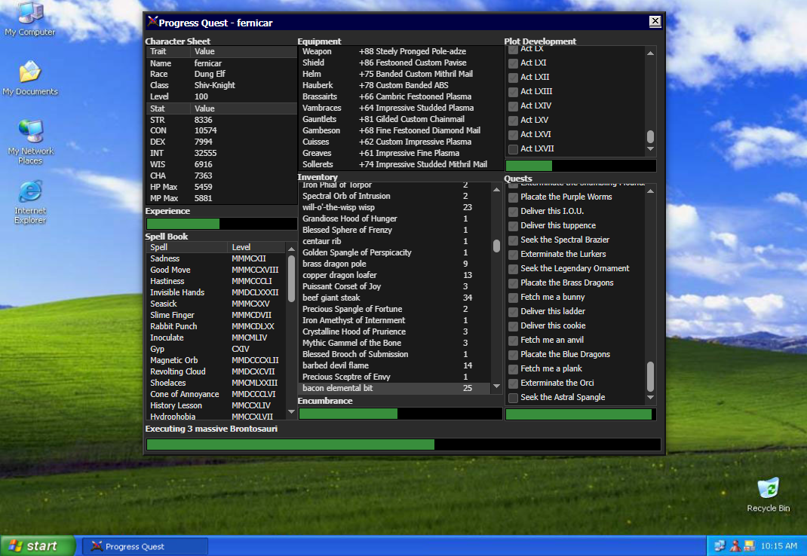
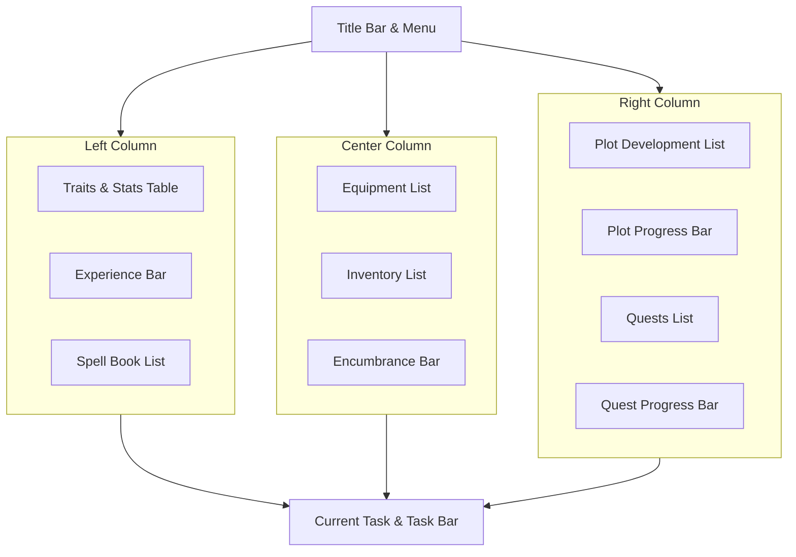

# Progress Quest Web

[](LICENSE)

## Screenshots

**Main Window:**


<!-- ZS:COMPLEXITY:MEDIUM -->
<!-- ZS:PLATFORM:WEB -->
<!-- ZS:LANGUAGE:TYPESCRIPT -->
<!-- ZS:FRAMEWORK:REACT -->
<!-- ZS:STYLE:RETRO -->

## Description

**Progress Quest Web** is a faithful web-based port of the legendary "zero-player game" (idle RPG). It is a satire of EverQuest and other MMORPGs, featuring a user interface that mimics a complex character sheet.

The application requires no user interaction after character creation. The software automatically runs a game loop where the character kills monsters, earns gold, returns to town to sell loot, buys better equipment, and levels up. It features a retro "Windows Classic" aesthetic, persistent local storage, and save-file import/export capabilities.

## Functionality

### Core Features

1.  **Zero-Player Gameplay**: The game plays itself. Progress bars fill up to trigger events.
2.  **Character Creation**: Users roll for stats and select from satirical Races and Classes.
3.  **Infinite Progression**: Levels, stats, and equipment scale indefinitely.
4.  **Roster Management**: Support for multiple save slots stored in LocalStorage.
5.  **Import/Export**: Ability to export characters to Base64 encoded `.pqw` files and import them back.
6.  **Retro UI**: High-fidelity recreation of the original Visual Basic-style interface.

### User Interface

The application has three distinct views:

#### 1. The Welcome Modal
A modal window appearing on first load:
-   **Header**: "Progress Quest" with sword icon.
-   **Content**: Satirical text explaining the game.
-   **Action**: A large "Play!" button leading to the Roster.

#### 2. The Roster
Displays existing characters.
-   **List**: Cards showing Name, Race, Class, Level, and "Best" stats (Plot, Equip, Spell).
-   **Actions**: "Play" (Sword icon), "Delete" (Skull icon), "Backup" (Disk icon - triggers download).
-   **New Character**: A button to enter the Character Creation screen.
-   **Import**: A file picker to load `.pqw` files.

#### 3. Character Creation (New Guy)
A window with form controls:
-   **Name**: Text input with a "Generate Random Name" button.
-   **Race/Class**: Radio button lists (Scrollable).
-   **Stats**: Table showing STR, CON, DEX, INT, WIS, CHA.
-   **Actions**: "Roll" (re-randomizes stats), "Sold!" (creates game and starts).
-   **Visual Feedback**: Total stat points are color-coded (Red for high rolls, Grey for low).

#### 4. Main Game View
The primary interface is a window divided into three columns.

**Layout Diagram:**



**Style Specifications:**
-   **Theme**: Dark mode, "Windows 95/2000" aesthetic.
-   **Colors**: Background `#121212`, Windows `#2b2b2b`, Borders `#444` (inset/outset styles).
-   **Fonts**: Tahoma or Sans-serif, 8pt-9pt.
-   **Progress Bars**: textured or solid colors with text overlays indicating numeric progress.

## Technical Implementation

### Architecture

-   **Framework**: React (functional components) with Vite.
-   **Language**: TypeScript.
-   **State Management**:
    -   `GameEngine`: Pure logic functions decoupled from UI.
    -   `useRef` for the main game loop (`requestAnimationFrame`) to ensure performance.
    -   `useState` for view switching and reacting to game ticks.
-   **Persistence**: Autosave to `localStorage` key `roster`.

### Data Structures

#### GameState Object
The core state object representing a character.

```typescript
interface GameState {
  Traits: {
    Name: string;
    Race: string;
    Class: string;
    Level: number;
  };
  Stats: Record<string, number>; // STR, CON, DEX, etc.
  Equips: Record<string, string>; // Slot -> Item Name
  Spells: [string, string][]; // [SpellName, RomanNumeralLevel]
  Inventory: [string, number][]; // [ItemName, Quantity]
  
  // Lists for scrollable log areas
  Plots: string[];
  Quests: string[];
  
  // Progress Bar States
  ExpBar: { position: number; max: number };
  EncumBar: { position: number; max: number };
  PlotBar: { position: number; max: number };
  QuestBar: { position: number; max: number };
  TaskBar: { position: number; max: number };
  
  // Current Action Data
  task: string;      // Internal tag (e.g., "kill|Orc", "market")
  kill: string;      // Display text (e.g., "Executing Orc")
  act: number;       // Current Act number
  bestplot: string;  // Last completed plot point
  bestequip: string; // Best item found
  bestspell: string; // Best spell learned
  
  queue: string[];   // Queue of tasks to process
}
```

### Game Logic & Algorithms

#### 1. The Tick Loop
The game loop runs on `requestAnimationFrame`. It calculates `elapsed` time (ms) and adds it to the `TaskBar.position`.

**When TaskBar fills:**
1.  **Resolve Current Task**:
    -   If `killing`: Add XP. If XP fills, Level Up.
    -   If `market`: Convert loot to Gold.
    -   If `buying`: Deduct Gold, upgrade Equipment.
2.  **Advance Secondary Bars**:
    -   Add progress to Plot Bar and Quest Bar (only if killing).
    -   If Plot Bar fills: Trigger "Interplot Cinematic" (series of flavor text tasks).
    -   If Quest Bar fills: Complete Quest, grant reward (Item/Stat/Spell), start new Quest.
3.  **Determine Next Task**:
    -   **Priority 1**: Queue (Cinematics/Story).
    -   **Priority 2**: Encumbrance full? -> Queue "Heading to market" -> "Sell".
    -   **Priority 3**: Have Gold > Cost of next gear? -> Queue "Negotiating purchase" -> "Buy".
    -   **Priority 4**: Default -> Generate Monster -> Set Task "Kill [Monster]".

#### 2. Generators (Satirical Content)
The app relies on specific arrays of strings to generate names and items.

*   **Name Generation**: Combine syllables (e.g., "br", "a", "ck").
*   **Monsters**: Format `Name|Level|Loot`. (e.g., "Kobold|1|penis", "Dragon|50|scale").
*   **Items**: `Attribute` + `Name` + `of` + `Effect`. (e.g., "Vicious Dry Goods of Foreboding").
*   **Equipment**: Standard RPG slots (Weapon, Shield, Helm, Hauberk, etc.).

## Asset Requirements

The application uses specific icons. If unavailable, use CSS placeholders or base64 approximations.
-   `swords.gif` (Icon)
-   `dicebar.jpg` (For stat rolling)
-   `back.jpg` (Global background texture)

## Testing Scenarios

1.  **New Game**: Click "New Character", see stats roll. Click "Sold!". Verify new character loads in Game View.
2.  **Game Loop**: Observe the Task Bar filling. Verify that when it fills, the description changes (e.g., from "Heading to..." to "Executing...").
3.  **Inventory**: Wait for a monster kill. Verify an item appears in Inventory.
4.  **Sales**: Wait for Encumbrance to fill. Verify character goes to "Market" and Inventory clears (except Gold).
5.  **Persistence**: Refresh the page. The character should remain in the Roster.
6.  **Export**: Click the Floppy Disk icon. A file download should start.
7.  **Import**: Delete the character. Upload the downloaded file. Character should reappear.

---

# Run and deploy your AI Studio app

This contains everything you need to run your app locally.

View your app in AI Studio: https://ai.studio/apps/drive/1fhRa5Gc63cHnXl0mhtrZTTAZd3bdpnse

## Run Locally

**Prerequisites:**  Node.js

1. Install dependencies:
   `npm install`
2. Run the app:
   `npm run dev`

## License

This project is licensed under the MIT License - see the [LICENSE](LICENSE) file for details.

## Acknowledgments

*   Special thanks to ScuffedEpoch for the [TINS](https://github.com/ScuffedEpoch/TINS) methodology and the initial example.
*   Thanks to Eric Fredricksen and the original [Progress Quest Web](https://bitbucket.org/grumdrig/pq-web) project contributors for the original game – you are a legend.
*   **AI Assistance:**
    *   Thanks to the AI assistants used during development for their contributions.
    *   Tested with Gemini-3-pro-preview from Google AI Studio App development.